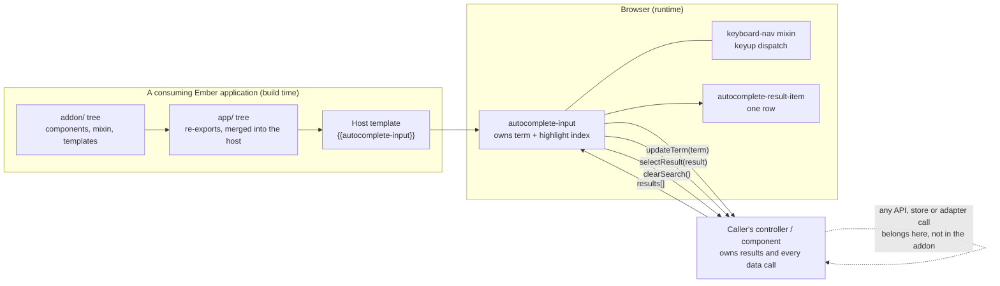

# `ember-cli-autocomplete-input` — GeeIQ fork

An Ember CLI **addon** (a library) providing a text input that renders a caller-supplied
list of results and handles keyboard navigation over it. It is consumed as a dependency by
an Ember application; it is not deployed, not invoked, and opens no network connection.

This document is the GeeIQ-side documentation for the fork. `README.md` in the repository
root is **upstream's**, left as its author wrote it, and it documents the upstream addon's
public API. Where upstream's text is now wrong for this repository, the correction is in the
delimited block at the top of that file and repeated below rather than edited into its body.

---

## Contents

- [Provenance — what this fork is](#provenance--what-this-fork-is)
- [Which ref holds the code](#which-ref-holds-the-code)
- [The GeeIQ delta](#the-geeiq-delta)
- [How a consumer uses it](#how-a-consumer-uses-it)
- [The contract it imposes on a caller](#the-contract-it-imposes-on-a-caller)
- [Import surface](#import-surface)
- [Export inventory](#export-inventory)
- [Name chain](#name-chain)
- [Architecture context](#architecture-context)
- [Release — how a version would be published](#release--how-a-version-would-be-published)
- [Consumption and liveness](#consumption-and-liveness)
- [Data access](#data-access)
- [Outputs and side effects](#outputs-and-side-effects)
- [Configuration](#configuration)
- [Tooling — tests, linting, CI](#tooling--tests-linting-ci)

---

## Provenance — what this fork is

**A genuine GitHub fork of the public npm package `ember-cli-autocomplete-input`.** It is not
first-party code that happens to share a public name, and not a history pushed into a fresh
repository.

| Evidence | Result |
|---|---|
| `gh repo view --json isFork,parent` | `isFork: true`, `parent: timjcook/ember-cli-autocomplete-input` |
| Fork-network object database | `gh api repos/timjcook/ember-cli-autocomplete-input/commits/32abc9f…` — **this fork's own 2026 merge commit** — resolves through the *parent's* API, which is only possible inside a shared fork network |
| Repository `createdAt` vs first commit | Repo created 2020-01-15; root commit is `6a1e4f8` *2017-06-15* (`Initial Commit from Ember CLI v2.12.1`, authored by `Tomster`, the Ember CLI scaffold identity). A history three years older than the repository is only possible via a fork or an import |
| Commit authorship | 43 of 47 commits are upstream's (41 by the upstream author, 1 the Ember CLI scaffold, 1 a GitHub merge identity). **4 are GeeIQ's** |
| Commit messages | `29e599f` — `Merge branch 'develop' of github.com:timjcook/ember-cli-autocomplete-input into develop` — records the upstream remote in a merge-commit message, in a repository whose tracked files never name it except in `package.json` `repository` |
| `package.json` | `repository: https://github.com/timjcook/ember-cli-autocomplete-input`, `author: Tim Cook`, `license: MIT` — all upstream's, unchanged by the fork |

**Ratio: 43 upstream commits to 4 in-house.** Upstream dominates, so the fork rules lead on
how the README is handled (upstream's body is untouched) while the document shape is a
library's. Upstream's own repository last received a push in September 2018 and is not
archived; this fork carries the only maintained line.

## Which ref holds the code

**`master`, the default branch, and it is genuinely the newest code — not a stub.** This is
worth stating because the estate contains an Ember addon whose default branch holds no
library code at all.

The history forks at `9237dac` (upstream's `Release/1.0.7`) into two lines that have never
been merged in either direction:

| Ref | Tip | Whose | Ember | Holds |
|---|---|---|---|---|
| `master` (default) | `32abc9f`, tag `v1.1.1` | GeeIQ | `ember-cli ~3.13.1`, `ember-source ~3.13` | **The library, at its newest** |
| `develop` | `1b61eb9` | upstream | `ember-cli ~3.1.4`, `ember-source ~3.1` | Upstream's 2018 Ember upgrade, superseded |
| `release/1.0.8` | `75bae6e`, tag `v1.1.0` | upstream | as `develop` | `develop` plus two version bumps |
| `michel/eng-5704-…` | `ec4ee22` | GeeIQ | as `master` | The merged PR #1 head, retained |

So GeeIQ performed its **own** Ember upgrade on `master` in January 2020, in parallel with —
and ahead of — upstream's on `develop`. `git merge-base --is-ancestor` puts two tags off
`master`: `v1.0.7` (on a one-commit upstream side branch) and `v1.1.0` (upstream's, on
`release/1.0.8`). Only `v1.1.1` contains the GeeIQ work.

**All 47 commits, 4 branches and 11 tags were swept**, and the refs are complete:
`git ls-remote origin` returns 22 lines — 16 tag lines for 11 tags (5 annotated, all
upstream's early ones, plus 6 lightweight), 4 branches, `HEAD`, and one retained
`refs/pull/1/head`. `git fetch --all --tags` brought nothing new, and `HEAD` equalled
`origin/master` before any file was read.

## The GeeIQ delta

Four commits: three by one author on 2020-01-15, and one estate-wide maintenance commit in
2026. `git diff 9237dac origin/master` is the whole of it.

**`85cedaa` — dropped the jQuery-based keyboard-navigation dependency.** The addon no longer
depends on an external keyboard-nav package; `addon/mixins/keyboard-nav.js` is a local
replacement that binds a single `keyup` listener with `addEventListener` and dispatches on
`e.which` (13 Enter, 27 Esc, 40 Down, 38 Up, anything else `onCustomPress`). The same commit
changed what the component's block form yields — the **dropdown body** rather than the input.

**`1ad679a` — Ember and Ember CLI raised to 3.13.**

**`2001099` — three template and event changes.**

- Removed the wrapper element from the input template.
- Added `on-focus-in` / `on-focus-out` callbacks, defaulting to no-ops, fired from the
  input's `focus-in` / `focus-out`. `focus-out` is deferred by `later(…, 250)` so that a
  click on a result item still lands before the dropdown closes.
- **Randomised the input's `name` attribute to stop Chrome inserting its own autofill
  options.** The template now renders `id=name name=nameGen`, where `nameGen` is
  `this.name || \`autocomplete_${Math.floor(Math.random() * 0xFFFFFF)}\``.

**`ec4ee22` (ENG-5704, merged as PR #1)** — added `.nvmrc` pinning Node `6` and tightened
`engines.node` from `>= 4` to `^6.0.0`, plus a `CLAUDE.md` describing the bump procedure.
Its own commit body records that Node 6 is EOL and was pinned to the existing declared
target rather than upgraded, and that no CI was wired because the repository's only CI
config is Travis. It touched no file under `addon/` or `app/`.

## How a consumer uses it

An Ember application declares the addon as a dependency and Ember CLI merges its `app/`
tree into the host application at build time, which is what makes the components resolvable
by name in any template:

```hbs
{{autocomplete-input
    name=name
    results=results
    updateTerm="updateTerm"
    selectResult="selectResult"}}
```

Block form receives each result, and is what the 2020 change re-aimed at the dropdown body:

```hbs
{{#autocomplete-input results=results updateTerm="updateTerm" as |result|}}
  {{result.label}} — {{result.subtitle}}
{{/autocomplete-input}}
```

## The contract it imposes on a caller

**This component reaches no API, and that is a substantive finding rather than an absence to
omit.** It holds no URL, no host, no path, no `store` or model name, no Ember Data adapter
or serializer, no `fetch`, no `$.ajax` and no HTTP client among its three dependencies
(`ember-cli-babel`, `ember-cli-htmlbars`, `ember-cli-htmlbars-inline-precompile`). Every
result it displays is handed to it by the caller.

What it does impose is a **shape contract**, and that is what makes a consumer's own data
edge findable:

| Slot | Contract |
|---|---|
| `results` | An array. Read as a plain array by index (`results[highlightedResultIndex]`) and iterated with `{{#each}}`. `hasResults` is `computed.notEmpty('results')`, so an empty array renders no dropdown |
| result **display** field | The attribute named by `resultName`, **defaulting to `name`** |
| result **identity** field | The attribute named by `resultValue`, **defaulting to `value`**. Used only for highlight comparison, by `===` against the highlighted result's same field |
| result **object type** | Either works. `getValue()` calls `object.get(attr)` when `object.get` exists and falls back to `object[attr]` — so an Ember Data record or `EmberObject` with computed properties is read through `get`, and a plain POJO by property access |
| `updateTerm(term)` | Fired on every change to the bound term, **de-duplicated against `lastTerm`** so an unchanged value does not re-fire. This is the caller's cue to refill `results` — the addon does not fetch |
| `selectResult(result)` | Fired with the **whole result object**, not its `resultValue` |
| `clearSearch()` | Fired on Esc. The addon does **not** clear `term` or `results` itself; the caller must |

Two consequences for a consumer:

- **There is no debounce, no minimum term length and no in-flight request tracking here.**
  `updateTerm` fires per keystroke, so any request rate, cancellation or ordering discipline
  is entirely the caller's responsibility.
- **A caller whose objects use different field names must pass `resultName` and
  `resultValue`.** Left at their defaults, a result lacking a `value` attribute makes every
  `isHighlighted` comparison `undefined === undefined`, which is true — so keyboard
  highlighting would mark every row.

## Import surface

The addon is consumed by **component name in a template**, which is the normal Ember route
and needs no import. Direct ES module imports are also possible, and these are the real
paths — the `app/` re-export files name them character for character:

```js
import AutocompleteInput      from 'ember-cli-autocomplete-input/components/autocomplete-input';
import AutocompleteResultItem from 'ember-cli-autocomplete-input/components/autocomplete-result-item';
import KeyboardNavMixin       from 'ember-cli-autocomplete-input/mixins/keyboard-nav';
```

## Export inventory

| Module | Kind | Default export | What it is for |
|---|---|---|---|
| `components/autocomplete-input` | `@ember/component` extending `KeyboardNavMixin` | the component class | The addon's reason to exist. Renders the text input and the results dropdown, owns `highlightedResultIndex`, and forwards `updateTerm` / `selectResult` / `clearSearch` to the caller. `classNames: ['autocomplete-input']`, with `hasFocus` bound as a class |
| `components/autocomplete-result-item` | `@ember/component` | the component class | One row of the dropdown. Resolves the display and identity fields through `getValue()`, computes `isHighlighted`, and renders `.autocomplete-result-item` with a `highlight` class when highlighted. Click calls `this.attrs.selectResult(result)` |
| `mixins/keyboard-nav` | `@ember/object/mixin` | the mixin | Reusable keyboard dispatch. `bindKeys(el)` attaches one `keyup` listener and calls `onEnterPress` / `onEscPress` / `onDownPress` / `onUpPress` / `onCustomPress`, all defined as no-ops so a consumer overrides only what it needs. Independently importable — the only part of this addon usable outside an autocomplete |
| `templates/components/autocomplete-input` | `.hbs` | — | Imported as `layout` by the component; not resolved by name |
| `templates/components/autocomplete-result-item` | `.hbs` | — | As above |
| `index.js` | Ember CLI addon entry point | `{ name: 'ember-cli-autocomplete-input' }` | The addon manifest. Declares the name and nothing else — no `included`, no `treeFor`, no `config`, no `isDevelopingAddon` override |

**No CSS ships.** The addon renders `.autocomplete-input`, `.autocomplete-results`,
`.autocomplete-result-item` and `.highlight` and provides no stylesheet for any of them, so
a consuming application must supply the dropdown's positioning and appearance itself.
`ember-cli-build.js` is development-only for the dummy app and `.npmignore` excludes it.

**Public surface by Ember version.** The components use `sendAction`, `this.attrs`,
`computed.notEmpty` and `observer` — all removed in Ember 4.0 — so the addon is usable by an
Ember 3.x application and not by a 4.x one. `ember-source ~3.13` is the version it was last
built and tested against.

## Name chain

| Link | Value |
|---|---|
| Repo | `ember-cli-autocomplete-input` (CheckpointGG, **public**, fork of `timjcook/ember-cli-autocomplete-input`) |
| `package.json` `name` | `ember-cli-autocomplete-input` — unscoped, upstream's own name, `version` **`1.0.7`** |
| `bower.json` `name` | `ember-cli-autocomplete-input`, no dependencies. Vestigial — Bower is not used by anything here |
| Ember addon name (`index.js`) | `ember-cli-autocomplete-input` — the name Ember CLI resolves the `app/` tree under |
| Resolvable component names in a host app | `autocomplete-input`, `autocomplete-result-item` |
| Serverless service / ECR image | none — nothing is built into an image. Established by enumerating the **whole path history** with `git log --all --name-only` over all 47 commits: no `serverless.{yml,ts}`, `Dockerfile`, `docker-compose.yml`, Kubernetes manifest, CDK app or `deploy/` directory has ever existed at any ref |
| CloudFormation stack | none |
| Deployed function or workload | none — an addon's code runs inside the build and the browser of whichever application depends on it, so its runtime identity is that application's |
| Event-source names | none — not invoked |
| Public host / API Gateway id | none. The repository names no hostname of its own at any ref |
| CDN distribution id | none |
| Other runtime labels | **`v1.1.1`** — a *lightweight* git tag (`git cat-file -t v1.1.1` → `commit`) on `32abc9f`, the ENG-5704 maintenance merge. It is the only tag containing the GeeIQ delta, has no GitHub release attached, and sits on a tree whose `package.json` still reads `1.0.7`, so the tag and the package version disagree by construction. Nothing consumes it |

## Architecture context



## Release — how a version would be published

**Nothing publishes this fork, and there is no pinnable published ref for it.**

- **No publish workflow, at any ref, and there never was one.** `.github/` has never existed:
  `git log --all --name-only` over all 47 commits on all 4 branches and 11 tags yields no
  `.github/` path, and `gh api repos/CheckpointGG/ember-cli-autocomplete-input/actions/workflows`
  returns `total_count: 0`. This is the *never had CI* reading, established from the added-path
  list rather than from an empty `gh run list` — which would have been indistinguishable from a
  workflow that cannot fire.
- **Has any publish ever succeeded?** There is no workflow to have succeeded or failed and no
  run history to have expired, so this is not a log-retention ambiguity. No `npm publish`
  invocation exists in any file at any ref.
- **Registry: none configured.** No `publishConfig`, no `.npmrc` at any ref, no scope on the
  package name. A bare `npm publish` from this tree would target `registry.npmjs.org` under
  the **unscoped** name `ember-cli-autocomplete-input`, which **upstream owns** — so it would
  be rejected. Publishing is not merely un-implemented; under the inherited name it is not
  possible without renaming or scoping the package. (This repository contains no evidence
  either way about npm ownership of that name; the statement rests on the name being
  upstream's, `repository` and `author` still pointing at upstream, and no ownership
  artefact existing here.)
- **`files` / `.npmignore`.** There is no `files` array, so `.npmignore` governs the tarball.
  It excludes `/tests`, `/dist`, `/tmp`, `/bower_components`, `config/ember-try.js`,
  `ember-cli-build.js`, `testem.js`, `bower.json`, `**/.gitkeep`, `.travis.yml` and the
  editor dotfiles. It does **not** exclude `addon/`, `app/`, `config/environment.js`,
  `index.js`, `README.md` or `LICENSE.md` — so the parts a consumer needs would ship.
  `docs/` is likewise not excluded, so this file would ride along in a tarball; harmless.
- **Entry point: resolves to a file that exists.** There is no `main`, so npm's default
  `index.js` applies, and `index.js` is real, tracked, three lines long and valid as an
  Ember CLI addon manifest. `app/` and `addon/` are both real directories with real files —
  `app/` holds two one-line re-export modules, `addon/` holds the two components, the mixin
  and the two templates. **Nothing here points at a build output that git does not carry.**
- **No build hook at all.** There is no `prepublish`, `prepublishOnly`, `prepare` or
  `prepack` script at any ref (`git grep` over all 47 commits). The addon ships its source
  and Ember CLI's own Babel pipeline compiles it inside the consuming application's build, so
  the absence of a build hook is correct rather than a trap — a modern `npm publish` would
  ship a complete, working tarball.
- **The install route a consumer actually has.** Since no registry copy of this fork exists,
  the only way to consume it is a git dependency —
  `"ember-cli-autocomplete-input": "CheckpointGG/ember-cli-autocomplete-input#<ref>"` — or a
  vendored copy. `ember install ember-cli-autocomplete-input`, as upstream's README
  instructs, installs **upstream's** published package, not this code.

## Consumption and liveness

**Dormant, and unconsumed. For a library, liveness is publication plus consumption, and both
are negative.**

- **The version has never moved in GeeIQ's hands.** `package.json` `version` is `1.0.7` on
  `master` — inherited at the fork point in 2018 — and is still `1.0.7` at `HEAD` after all
  four in-house commits. The `v1.1.1` tag was applied to the ENG-5704 maintenance merge
  without touching the version field, and is wired to nothing: no publish workflow to
  trigger, no GitHub release (`gh release list` is empty), no consumer to pin it.
- **Nothing consumes it.** A sibling-clone sweep across all 169 repositories in the clone
  set found no dependency on it and no use of it: no `package.json` naming it, no git
  dependency spec, no import of either component or the mixin, and no `{{autocomplete-input}}`
  or `{{autocomplete-result-item}}` in any template. The three other Ember repositories in
  the estate were checked **over their entire histories**, not just at `HEAD`, and none has
  ever referenced it. (GitHub code search is unavailable for this organisation, confirmed
  against a control query, so the clone set is the bound: a consumer outside it would not be
  visible.)
- **Its own activity is maintenance, not use.** The 2026 commits are an estate-wide runtime
  pinning pass whose own body says CI was not wired, and they changed no file under `addon/`
  or `app/`. Recent commits are not evidence a library is depended upon.
- **Can it report failure?** **n/a**, stated rather than left blank. There is no outermost
  handler, no scheduled run, no invocation and no success value that anything consumes — the
  code is a pair of component classes and a mixin. The nearest real thing is that a click on
  a result item calls `this.attrs.selectResult(result)` **without a guard**, so an application
  that renders the component with no `selectResult` handler gets a `TypeError` in the
  browser at click time; that failure surfaces in the consumer's process, not here.

## Data access

**None. This repository has no data-access rows, and that is the correct answer rather than
a gap.** Two independent reasons, both worth stating:

- **There is nothing to attribute.** No table, collection, index, bucket path, cache key,
  topic, stored-procedure `CALL` or SQL statement of any kind exists at any of the 47 commits
  on any of the 4 branches or 11 tags, and there is no datastore client, HTTP client or Ember
  Data adapter among the dependencies. The component never receives a query, a URL or a model
  name — it receives an array.
- **Even if it did, the access would belong to the caller.** A consuming application that
  populates `results` from an API or an Ember Data store lists that access in **its own**
  documentation. Recording it here as well would double-count every consumer's footprint
  against a package that opens no connection. The per-table pass must attribute nothing to
  this repository.

## Outputs and side effects

- Renders DOM inside the consuming application: `.autocomplete-input` wrapper, an
  `input[type="text"]`, and a `.autocomplete-results` container of
  `.autocomplete-result-item` rows.
- Attaches one `keyup` event listener to the input element in `didInsertElement`, via the
  mixin's `bindKeys`. **It is never removed** — there is no `willDestroyElement` — so the
  listener's lifetime is the element's.
- Schedules a `later(…, 250)` runloop timer on every focus-out, which then mutates `hasFocus`
  and calls the caller's `on-focus-out`.
- Sets the rendered input's `name` attribute to a random `autocomplete_<hex>` token when no
  `name` is passed, which is a deliberate change to how the browser's own autofill behaves in
  the consuming page.
- Nothing else: no log writes, no local file I/O, no `localStorage` or `sessionStorage`, no
  cache, no object store, no topic, no network request.

## Configuration

**The addon contributes nothing to a consuming application's configuration, and there are
exactly two routes by which an Ember addon could — both were checked.**

For an Ember application, `config/environment.js` `ENV` is serialised at build time into a
`<meta name="<modulePrefix>/config/environment">` tag in the shipped `index.html`; grepping
for `import.meta`, `VITE_`, `NEXT_PUBLIC_` or `REACT_APP_` answers a different framework's
question and would return nothing here regardless. For an **addon**, the two real injection
routes are:

1. **A `config(env, baseConfig)` hook in `index.js`** — **absent.** `index.js` exports
   `{ name: 'ember-cli-autocomplete-input' }` and nothing else, at every ref.
2. **A populated `config/environment.js`** — **present but empty.** It exports
   `function(/* environment, appConfig */) { return { }; }`, unchanged at every ref
   (`master`, `develop`, `release/1.0.8`). An empty object, so nothing of this addon's is
   merged into a consumer's `ENV` and nothing of it reaches that `<meta>` tag.

`isDevelopingAddon()` is **not overridden**, so Ember CLI's default applies and build-tree
caching in a consuming application is unaffected. (An addon that returns `true`
unconditionally would disable tree caching in every consuming build; this one does not.)

There is **no runtime configuration surface**: no `process.env` read anywhere, no `.env`,
`.env.example` or `docs/Configuration.md`, and no env var forming part of the public API.
`tests/dummy/config/environment.js` configures the addon's own development dummy application
only, is excluded from the published tarball by `.npmignore`, and holds no values —
`modulePrefix: 'dummy'`, `rootURL: '/'`, and otherwise commented-out example flags.

`ember-addon.configPath` is `tests/dummy/config`, which is how Ember CLI finds the dummy
app's configuration when the addon is developed in isolation.

## Tooling — tests, linting, CI

- **Tests: present.** Two integration suites and one unit suite under `tests/`, run through
  Ember's own test harness against the dummy application. They pin the input's rendered
  `name` and `id` attributes, the placeholder, the result-item display and highlight
  behaviour, and computed-property results. Not executed by this pass, which reads code only.
- **Test coverage of the GeeIQ delta.** `tests/integration/components/autocomplete-input-test.js`
  asserts that the rendered `name` **and** `id` both equal the passed `name` — which holds,
  because `nameGen` returns `this.name` when one is given. **No test covers the case the 2020
  change exists for**: no assertion exercises the randomised token that appears when `name`
  is omitted, and none covers `on-focus-in` / `on-focus-out`. Recorded as a gap in the
  evidence, not as work to do.
- **Linter: ESLint**, via `.eslintrc.js` and the `ember-cli-eslint` build-time integration
  (there is no standalone `lint` script on `master`; `develop` and `release/1.0.8` add one).
- **CI: none, and none has ever existed for this repository.** No GitHub Actions workflow at
  any ref; `gh run list` is empty because there is nothing to run, and PR #1 was therefore
  merged unchecked. `.travis.yml` is inherited from upstream and inert — the organisation does
  not use Travis CI, and travis-ci.org, which the README's badge points at, no longer serves
  builds. The badge describes upstream's repository in any case.
- **Node version:** `.nvmrc` `6` and `engines.node` `^6.0.0` (ENG-5704). Nothing reads
  `.nvmrc`, because there is no `actions/setup-node` step to point at it; the commit body
  says so itself, and also records that Node 6 is EOL and was pinned rather than upgraded.
- **Git hooks:** none.
- **Bower:** `bower.json` and `.bowerrc` are tracked and vestigial; no Bower dependency is
  declared and nothing installs them.
